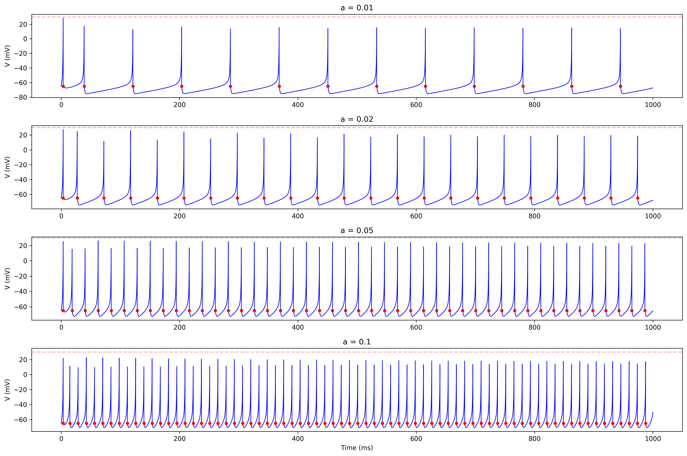
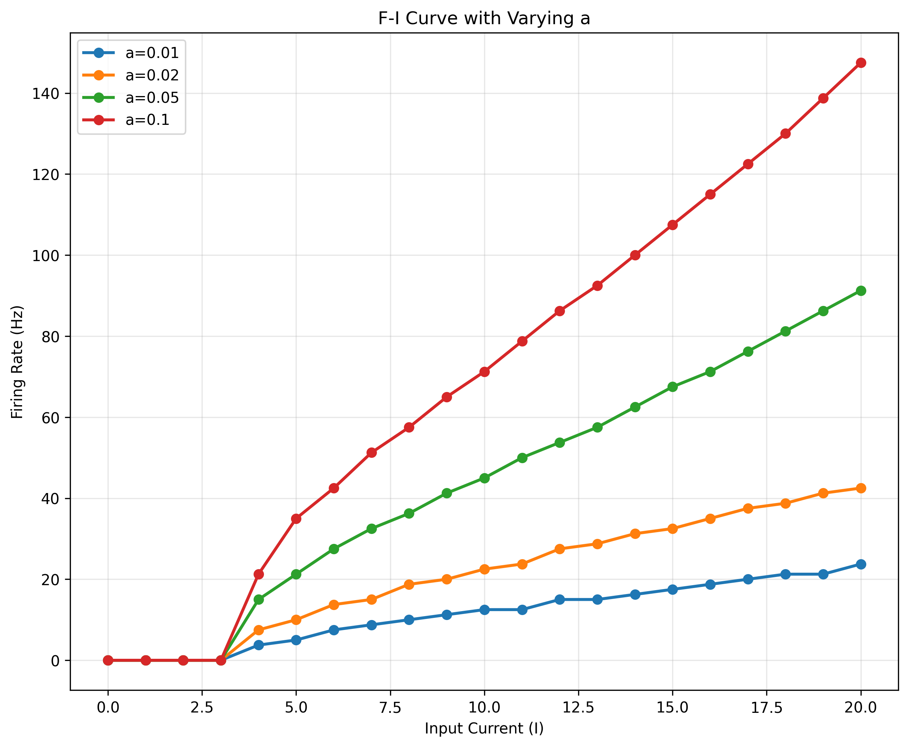
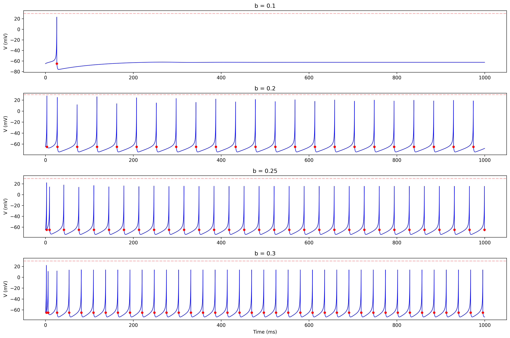
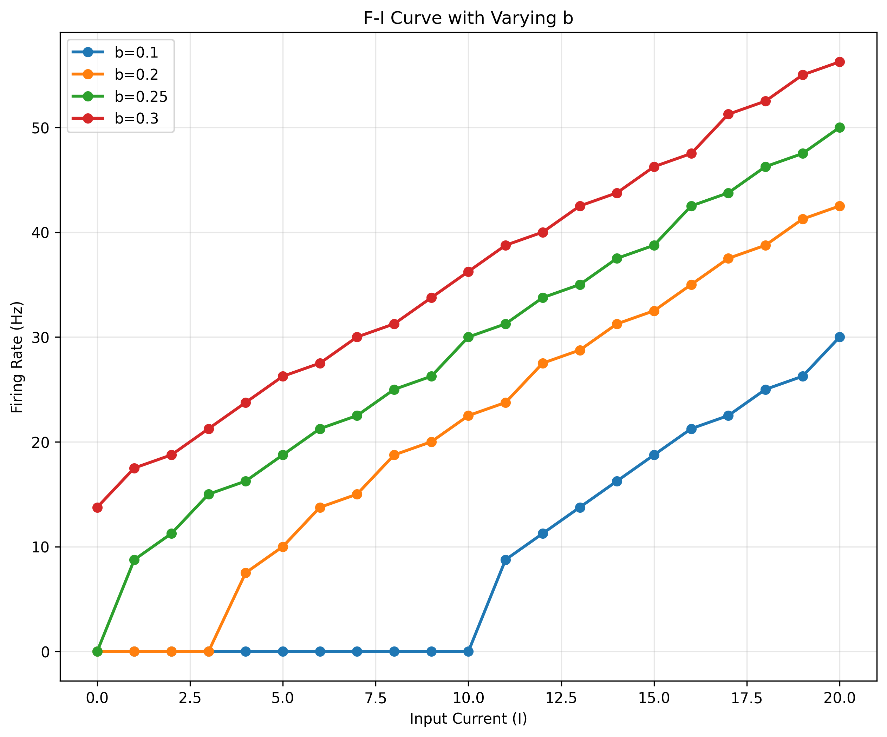
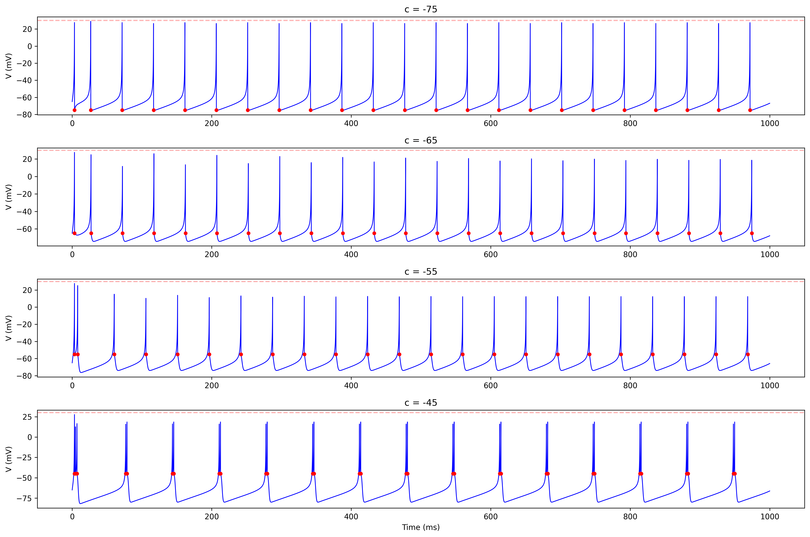
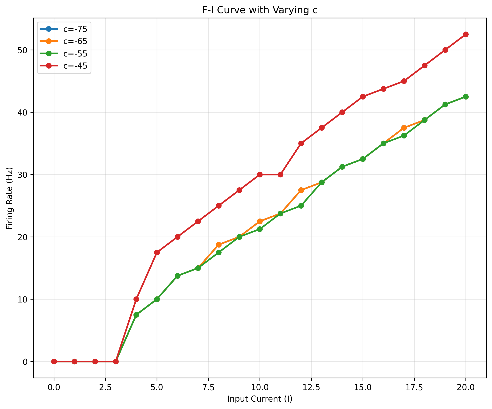
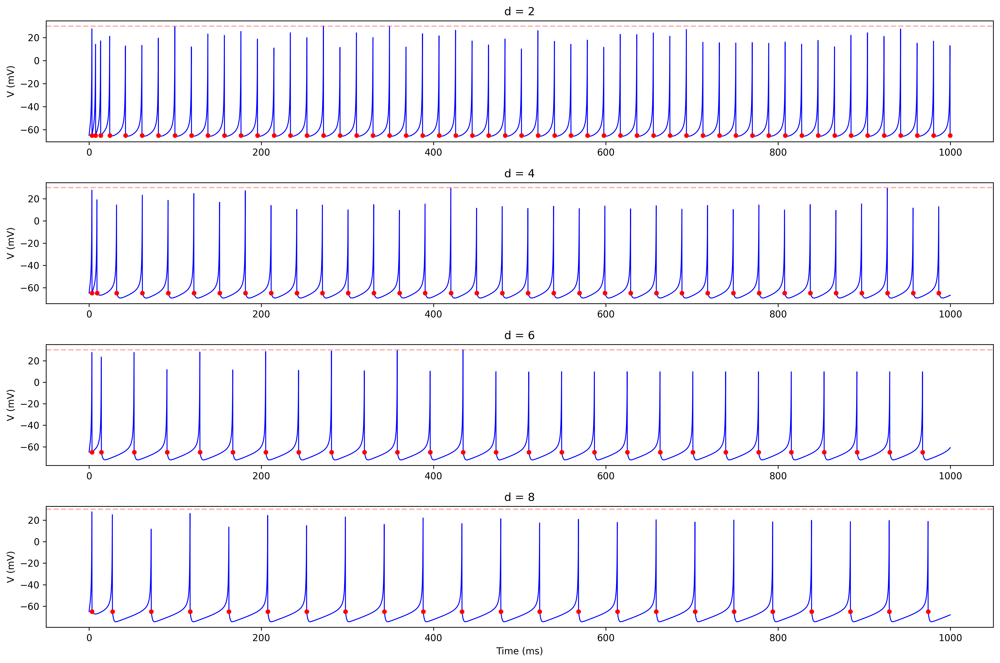
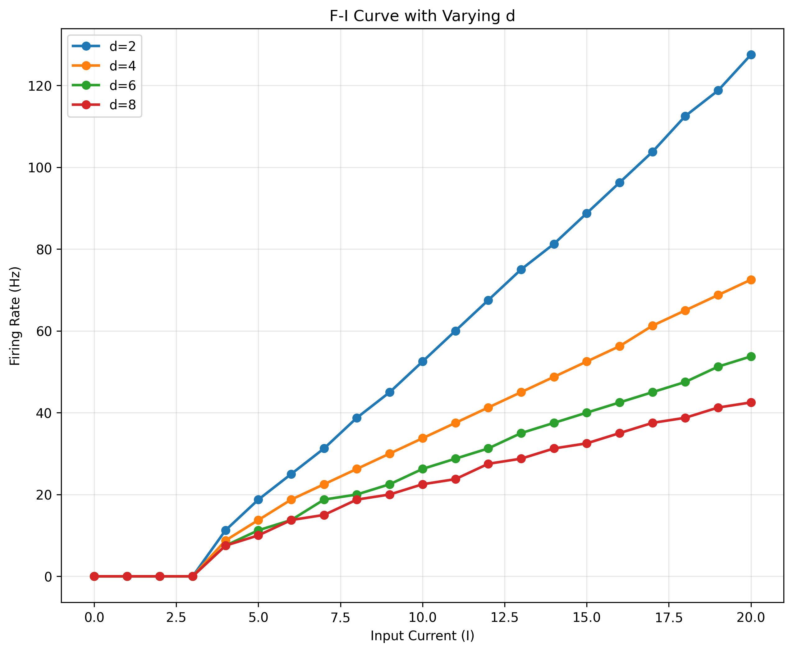

# Izhikevich Neuron Parameter Analysis: Visual Data

This report provides visual analysis of how each parameter in the Izhikevich model affects neural behavior, complementing the more narrative explanations in the main report.

## Parameter Effects on Neural Dynamics

### Parameter a Analysis (Recovery Time Scale)

**Key Observations:**
- As 'a' increases from 0.02 to 0.1, recovery after firing becomes dramatically faster
- With a=0.1, neurons can transition from regular spiking to fast spiking
- Affects adaptation speed and firing sustainability

**Impact on Input-Output:**
- Larger 'a' values generally decrease firing rates across all input currents
- The threshold current (minimum current needed to trigger firing) increases with 'a'
- The slope of the F-I curve tends to flatten with larger 'a' values

### Parameter b Analysis (Recovery Variable Sensitivity)

**Key Observations:**
- As 'b' increases from 0.2 to 0.25 and beyond, subthreshold behavior changes significantly
- Higher 'b' values create stronger coupling between voltage and recovery variable
- Can induce resonance properties and even bistability at values near 0.3

**Impact on Input-Output:**
- Threshold current typically increases with 'b'
- The F-I curve's slope may decrease with larger 'b' values
- At very high values (b > 0.25), neurons may show frequency preference (resonance)

### Parameter c Analysis (After-Spike Reset Value)

**Key Observations:**
- Less negative 'c' values (e.g., changing from -65mV to -50mV) reduce post-spike hyperpolarization
- When 'c' is -55mV or higher, neurons tend to develop bursting behavior
- More negative values extend the refractory period between spikes

**Impact on Input-Output:**
- Less negative 'c' values generally increase firing rates for the same input
- Can lower the threshold current needed for firing
- The effect on F-I curve shape varies with specific 'c' values

### Parameter d Analysis (After-Spike Recovery Reset)

**Key Observations:**
- Smaller 'd' values (2-4) produce more regular, consistent firing patterns
- Larger 'd' values (6-8) create stronger spike-frequency adaptation
- Very low 'd' values can transform regular spiking into tonic (fast) spiking

**Impact on Input-Output:**
- Smaller 'd' values generally result in higher steady-state firing rates
- The threshold current is less affected by 'd' than by other parameters
- The slope of the F-I curve tends to be steeper with smaller 'd' values

## Technical Applications

This visual data is particularly useful when:

- Fine-tuning models to match experimental recordings
- Understanding how parameter changes affect network dynamics
- Developing hypotheses about neuron type differentiation
- Creating heterogeneous neural populations with varied response properties

The figures clearly demonstrate that while each parameter has a primary effect, they also interact in complex ways to produce the rich diversity of neuronal behaviors found in biological systems.
